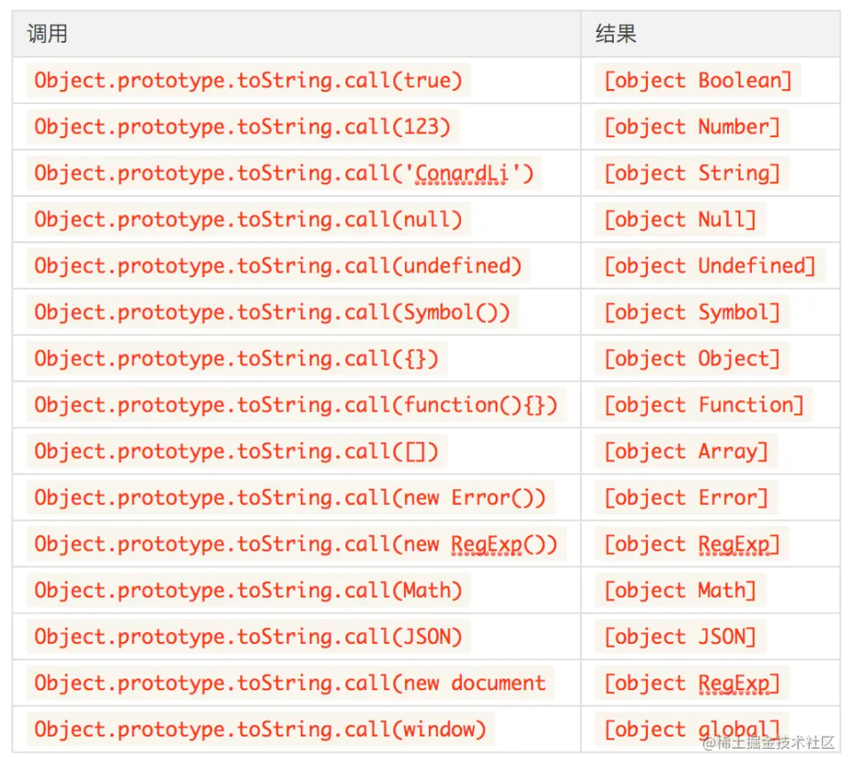

# 变量和类型

## 一、JavaScript数据类型

最新的ECMAScript标准定义了8种数据类型，其把这些数据类型又分为两种：原始类型和对象类型。

### 原始类型

除了Object以外的所有类型都是不可变的（值本身无法被改变）

#### `Null`

只包含一个值：null

#### `Undefined`

一个没有被赋值的变量会有个默认值 `undefined`，只包含一个值：undefined

#### `Boolean`

包含两个值：true和false

#### `Number`

根据 ECMAScript 标准，JavaScript 中只有一种数字类型：基于 IEEE 754 标准的双精度 64 位二进制格式的值（-(2^53 -1) 到 2^53 -1）。 它并没有为整数给出一种特定的类型 。除了能够表示浮点数外，还有一些带符号的值：`+Infinity`，`-Infinity` 和 `NaN` (非数值，Not-a-Number)。

#### `BigInt`

JavaScript 中的一个基础的数值类型，可以用任意精度表示整数。它提供了一种方法来表示大于 `2^53 - 1` 的整数。使用 BigInt，您可以安全地存储和操作大整数，甚至可以超过数字的安全整数限制。BigInt 是通过在整数末尾附加 `n `或调用构造函数来创建的。由于在 `Number` 与 `BigInt` 之间进行转换会损失精度，因而建议仅在值可能大于2^53 时使用 `BigInt` 类型，并且不在两种类型之间进行相互转换。

#### `String`

一串表示文本值的字符序列

#### `Symbol`（符号类型）

符号类型是唯一的并且是不可修改的, 并且也可以用来作为 Object 的 key 的值

### 对象类型

在计算机科学中, 对象是指内存中的可以被标识符引用的一块区域。

#### `Object`

自己分一类丝毫不过分，除了常用的Object，Array、Function等都属于特殊的对象

## 二、类型判断

### typeof操作符

一个表示对象或原始值的表达式，其类型将被返回。

语法

typeof 运算符后接操作数：

```javascript
typeof operand
typeof(operand)
```

| 类型      | 结果        |
| :-------- | ----------- |
| Undefined | "undefined" |
| Null      | "object"    |
| Boolean   | "boolean"   |
| Number    | "number"    |
| BigInt    | "bigint"    |
| String    | "string"    |
| Symbol    | "symbol"    |
| Function  | "function"  |
| 其他对象  | "object"    |

除函数外所有的引用类型都会被判定为 `object`。
另外 `typeof null === 'object'`也会让人感到头痛，这是在 `JavaScript`初版就流传下来的 `bug`，后面由于修改会造成大量的兼容问题就一直没有被修复...

### instanceof

`instanceof`操作符可以帮助我们判断引用类型具体是什么类型的对象：

```javascript
[] instanceof Array // true
new Date() instanceof Date // true
new RegExp() instanceof RegExp // true
```

我们先来回顾下原型链的几条规则：

* 1.所有引用类型都具有对象特性，即可以自由扩展属性
* 2.所有引用类型都具有一个`__proto__`（隐式原型）属性，是一个普通对象
* 3.所有的函数都具有`prototype`（显式原型）属性，也是一个普通对象
* 4.所有引用类型`__proto__`值指向它构造函数的`prototype`
* 5.当试图得到一个对象的属性时，如果变量本身没有这个属性，则会去他的`__proto__`中去找

`[] instanceof Array`实际上是判断 `Array.prototype`是否在 `[]`的原型链上。

所以，使用 `instanceof`来检测数据类型，不会很准确，这不是它设计的初衷：

```javascript
[] instanceof Object // true
function(){}  instanceof Object // true
```

另外，使用 `instanceof`也不能检测基本数据类型，所以 `instanceof`并不是一个很好的选择。

### toString

上面我们在拆箱操作中提到了 `toString`函数，我们可以调用它实现从引用类型的转换。

> 每一个引用类型都有 `toString`方法，默认情况下，`toString()`方法被每个 `Object`对象继承。如果此方法在自定义对象中未被覆盖，`toString()` 返回 `"[object type]"`，其中 `type`是对象的类型。

```javascript
const obj = {};
obj.toString() // [object Object]
```

注意，上面提到了 `如果此方法在自定义对象中未被覆盖`，`toString`才会达到预想的效果，事实上，大部分引用类型比如 `Array、Date、RegExp`等都重写了 `toString`方法。

我们可以直接调用 `Object`原型上未被覆盖的 `toString()`方法，使用 `call`来改变 `this`指向来达到我们想要的效果。



## 三、编写一个判读类型的方法

```javascript
let typeList = {};
"Boolean Number String Function Array Date RegExp Object Error Null Undefined".split(" ").map(item => {
    typeList[`[object ${item}]`] = item.toLowerCase();
})

function type(target) {
    if (target == null) {
        return target + ""
    }
    return typeof target === 'object' || typeof target === 'function' ?
        typeList[Object.prototype.toString.call(target)] || 'object':
        typeof target
}
```

## 参考

* [【JS 进阶】你真的掌握变量和类型了吗](https://juejin.cn/post/6844903854882947080)
* [近 20 人爆肝数周，写给初中级前端的万字高级进阶指南](https://juejin.cn/post/7017645909483716615#heading-11)
* [JavaScript 数据类型和数据结构](https://developer.mozilla.org/zh-CN/docs/Web/JavaScript/Data_structures)
