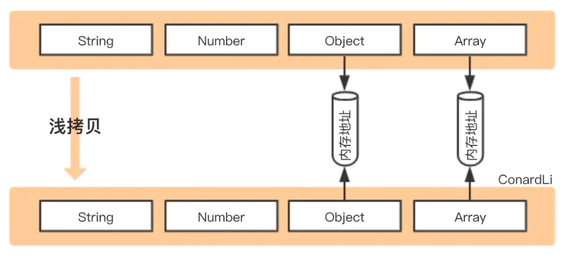
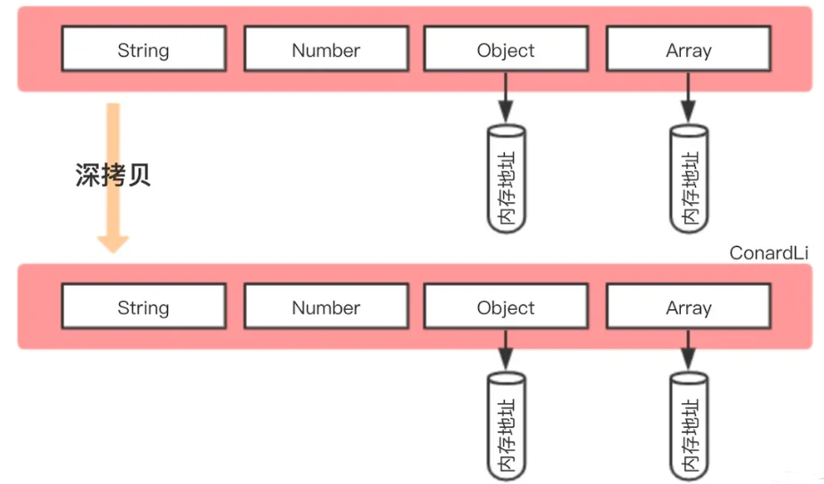

# 浅拷贝与深拷贝

* 浅拷贝和深拷贝都是创建一份新的数据拷贝。
* JS 分为原始类型和引用类型，对于原始类型的拷贝，并没有深浅拷贝的区别，我们讨论的深浅拷贝都只针对引用类型。
* 浅拷贝：指复制对象的时候只对**第一层**的键值进行独立的复制，如果对象内嵌套对象，则只能复制嵌套对象的地址，修改原对象或者拷贝对象内的嵌套对象会影响另一个。拷贝级别浅，适合只有一层数据的时候。
* 深拷贝：指复诊对象的时候**无限层级**的拷贝，即使是嵌套了对象，两者也互相分离，修改一个对象的属性也不会影响另一个。拷贝级别更深，深拷贝后的原对象和拷贝对象互不影响。

## 浅拷贝



> 创建一个新对象，这个对象有着原始属性值的一份精确拷贝。如果属性值是基本类型，拷贝的就是基本类型的值；如果属性值是引用类型，拷贝的就是内存地址，所以如果其中一个对象改变就变影响到另一个对象。

**浅拷贝的实现：**

* 对象:`Object.assign()`可以把任意多个的源对象自身的可枚举属性拷贝给目标对象，然后返回目标对象。

  ```javascript
  const obj = {
    name: "apple"
  };

  const newObj1 = Object.assign({}, obj);
  ```
* 数组：

  * `Array.slice()`、`Array.concat()`返回一个新数组的特性来实现拷贝。
  * 数组静态方法`Array.from()`

  ```javascript
  const arr = ['a', 'b', 'c', {
    value: 1
  }];
  const newArr1 = arr.slice(0);
  const newArr2 = [].concat(arr);
  const newArr3 = Array.from(arr);
  ```
* 扩展运算符：`...`

  ```javascript
  //接着上面的变量
  const newObj2 = { ...obj };
  const newArr4 = [...arr];
  ```
* 手动遍历实现

  ```javascript
  function clone(target) {
    let cloneTarget = {};
    for (const key in target) {
      cloneTarget[key] = target[key];
    }
    return cloneTarget;
  };
  ```

## 深拷贝



> 深拷贝后的原对象和拷贝对象互不影响。

**深拷贝的实现：**

* `JSON.parse(JSON.stringify(obj))` 把一个对象转化成一个字符串，再把这个字符串转化成一个对象。但是这种方式存在弊端，这种方式转不了正则、函数、时间、symbol和undefined，会丢失值，`NaN`、`Infinity`、`-Infinity` 会被序列化为`null`，也解决不了循环引用的问题（会报错）。
  ```javascript
  const newObj3 = JSON.parse(JSON.stringify(obj));
  ```
*

---

参考

* [轻松拿下 JS 浅拷贝、深拷贝](https://juejin.cn/post/7072528644739956773)
